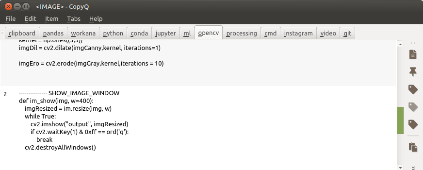
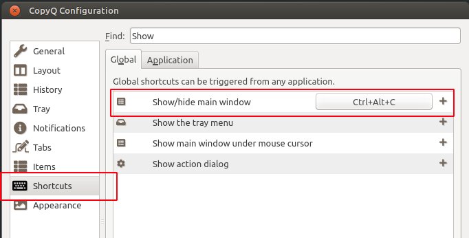
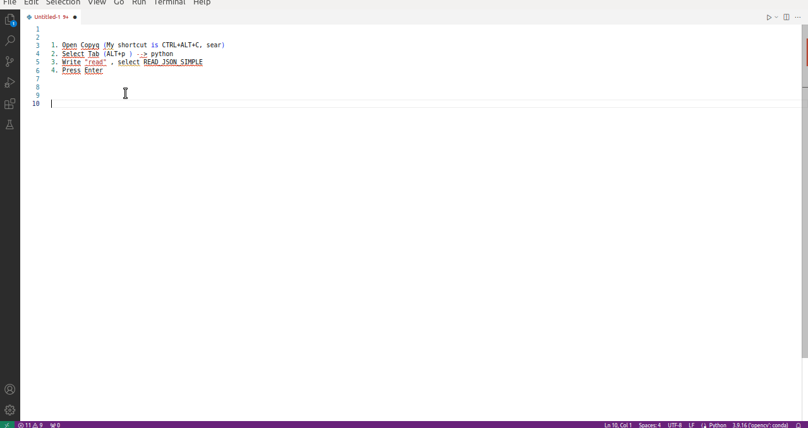

## Clipboard manager   

[CopyQ](https://hluk.github.io/CopyQ/) is a clipboard manager (cross platform)


### How do I use it?

- I use **tabs** to to group of related things like: opencv stuff, python stuff, some commands, etc:

  

- Content of each tab is defined in a text file like **\<tab order number>_\<tab name>_data.txt** (e.g: [04_&opencv_data.txt](my_copyq/04_opencv_data.txt)).

  Each file have several items identified by **"--------------- \<some title>*** (5 or more '-'), e.g:
    
    ```
    --------------- IMPORT_OPENCV
    import cv2
    import imutils as im
    import sys
    import os

    import numpy as np
    import matplotlib.pyplot as plt
    import pandas as pd
    import seaborn as sns

    --------------- SHOW_IMAGE_WINDOW
    def im_show(img, w=400):
        imgResized = im.resize(img, w)  
        while True:
            cv2.imshow("output", imgResized)
            if cv2.waitKey(1) & 0xff == ord('q'):
                break
        cv2.destroyAllWindows()

    ```

- Script [do_copyq.py](my_copyq/do_copyq.sh) is used to load these files to copyq


- I recommend  define a shortcut for **Show/hide main window**  (Preference > Shortcut), e.g: **CTRL+Alt+C**



- Example 

- 


